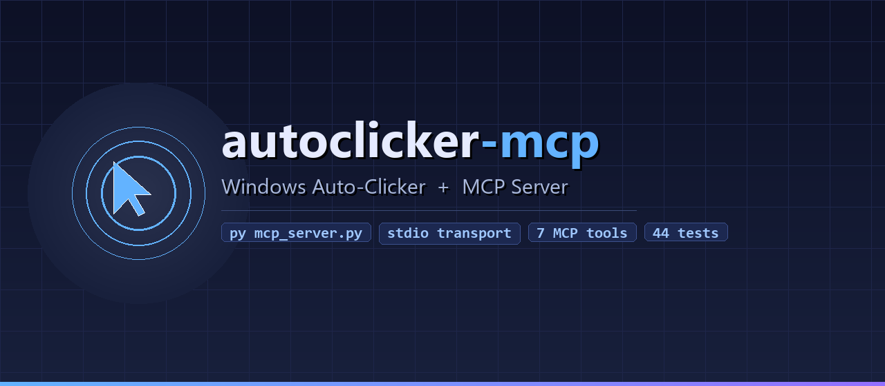

# autoclicker-mcp



A Tkinter auto-clicker GUI **and** an [MCP](https://modelcontextprotocol.io/) server that exposes the same functionality as AI-callable tools.

The GUI app clicks the left mouse button either for a fixed duration or continuously.  
The MCP server lets Claude (or any MCP client) control the clicker, query the cursor position, and locate UI elements by image or OCR text.

| Component | Windows | macOS | Linux |
|---|:---:|:---:|:---:|
| MCP server (`mcp_server.py`) | ✅ | ✅ | ✅ |
| GUI (`autoclicker_gui.py`) | ✅ | - | - |

> **macOS / Linux note:** the MCP server uses `pyautogui` for mouse control on non-Windows platforms, so `pyautogui` and `pillow` are required there (see install steps below).

---

## Quick start

```powershell
# Install core dependency
pip install mcp

# macOS / Linux - also required for mouse control
pip install pyautogui pillow

# Run the GUI (Windows only)
py autoclicker_gui.py

# Run the MCP server (Windows / macOS / Linux)
python mcp_server.py
```

---

## MCP server

### What it exposes

| Tool | Description |
|---|---|
| `start_clicker` | Start clicking (cursor / fixed / image / text mode) |
| `stop_clicker` | Stop clicking |
| `get_clicker_status` | JSON status: `{running, status}` |
| `get_cursor_position` | JSON cursor coords: `{x, y}` |
| `click_at` | Single click at an absolute screen position |
| `find_image_on_screen` | Template-match an image → `{found, x, y}` |
| `find_text_on_screen` | OCR text search → `{found, x, y}` |

### Register with VS Code / Claude Desktop

Add to your MCP client config (e.g. `claude_desktop_config.json`):

```json
{
  "mcpServers": {
    "autoclicker": {
      "command": "python",
      "args": ["a:/Tools/Automator/mcp_server.py"]
    }
  }
}
```

### Optional dependencies for image / OCR modes

```powershell
# Image matching
py -m pip install pyautogui pillow

# Confidence-based matching (< 1.0)
py -m pip install opencv-python

# OCR text search
py -m pip install pytesseract pyautogui pillow
winget install --id UB-Mannheim.TesseractOCR -e
```

---

## GUI - how to use (Windows only)

> The Tkinter GUI uses Win32 global hotkeys and is Windows-only. The MCP server works everywhere.

1. Choose mode: **Timed** or **Continuous**.
2. Set **Clicks per second** (max 200).
3. Pick **Click target**:
   - **Current cursor** - click wherever the mouse is.
   - **Fixed position** - click a saved X/Y coordinate.
   - **Find image on screen** - locate a UI element by screenshot crop.
   - **Find text on screen (OCR)** - locate text like "Start download".
4. If Timed, set **Duration** in seconds.
5. Set **Start delay** (time to switch to another window).
6. Press **Start**.

## Hotkeys

| Key | Action |
|---|---|
| F6 | Start (global) |
| F7 | Stop (global) |
| Esc | Emergency stop (global) |

These work even when the app is not focused.

## Floating controls

Enable **Show floating controls** to open a small always-on-top Start/Stop panel in the corner of your screen.

---

## Tests

```powershell
py -m pytest tests/ -v
```

All 44 tests run without a display, Tesseract, or pyautogui installed.

---

## Notes

- Windows only (uses Win32 mouse events).
- Click rate is capped at 200 CPS for stability.
- Optional Always-on-top toggle keeps the GUI visible over other windows.

